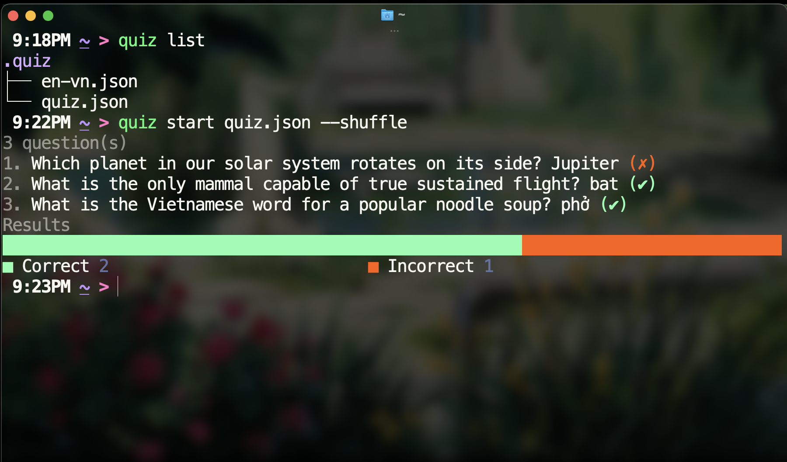

# Quiz

Simple quiz CLI with culture-aware answer matching.



## Installation
Install dotnet sdk/runtime from https://dotnet.microsoft.com/download
Then pack and install the quiz tool globally from this repository:
```bash
$ dotnet pack -c Release
$ dotnet tool install --global --add-source ./artifacts AnthonyGiang.Quiz
```

If you already have it installed, update it from the local package source instead:

```bash
$ dotnet tool update --global --add-source ./artifacts AnthonyGiang.Quiz
```

If `quiz` is not found afterwards, add the .NET tools directory to your `PATH`:

```bash
$ cat <<'EOF' >> ~/.zshrc
export PATH="$PATH:$HOME/.dotnet/tools"
EOF
$ zsh -l
```

## Usage
List all quiz files in `$HOME/.quiz` directory:
```bash
$ quiz list
```
Start a quiz from a quiz file:
```bash
$ quiz start <file.json>
```

## Explanation
Quiz files are represented as JSON arrays in the following format:

```json
[
  {
    "question": "What is the capital of Australia?",
    "answer": "Canberra",
    "culture": "en-AU"
  },
  {
    "question": "¿Cuál es la capital de España?",
    "answer": "Madrid",
    "culture": "es-419"
  },
  {
    "question": "フランスの首都は何ですか？",
    "answer": "パリ",
    "culture": "ja-JP"
  }
]


```
Common culture values:
1. en-US - English (United States)
2. en-GB - English (United Kingdom)
3. es-419 - Spanish (Latin America and Caribbean)
4. fr-FR - French (France)
5. it-IT - Italian (Italy)
6. de-DE - German (Germany)
7. ru-RU - Russian (Russia)
8. pt-BR - Portuguese (Brazil)
9. hi-IN - Hindi (India)
10. zh-Hans-CN - Chinese (Simplified, China)
11. ja-JP - Japanese (Japan)
12. ko-KR - Korean (South Korea)
13. vi-VN - Vietnamese (Vietnam)
14. id-ID - Indonesian (Indonesia)
15. el-GR - Greek (Greece)
